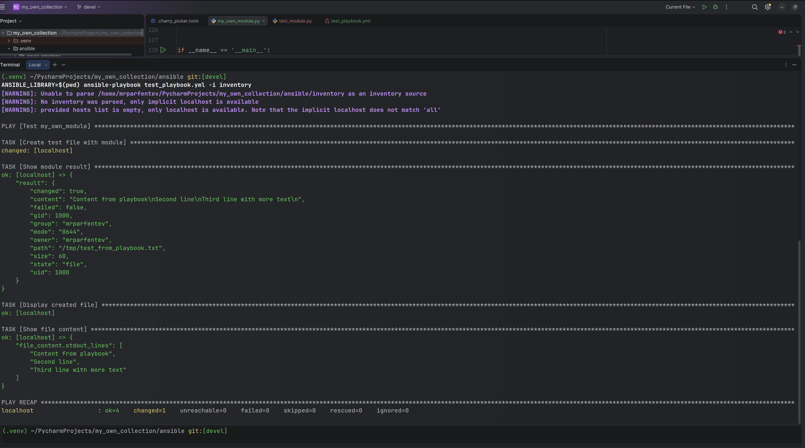
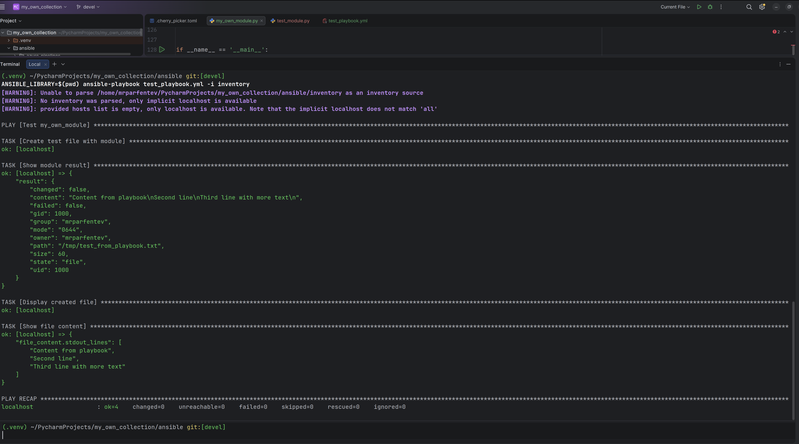
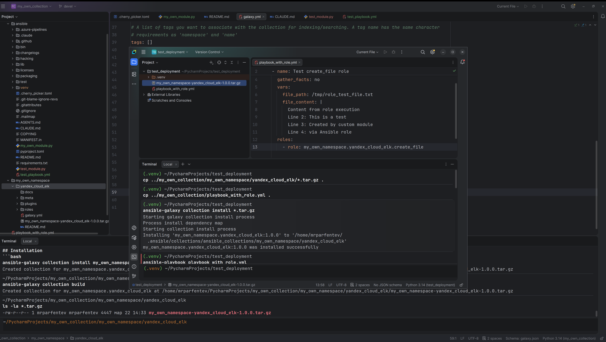

# Лабораторная работа: Создание собственного модуля Ansible

## Шаг 4. Проверка модуля на исполняемость локально

## Шаг 6. Проверка идемпотентности

Второй запуск playbook показывает `changed=0`

## Шаг 15. Установка collection из локального архива

Установка коллекции:

## Шаг 16. Запуск playbook

Playbook успешно выполнен, роль создала файл с заданным содержимым.
Проверка установленной коллекции:

## Результат выполнения

Все шаги лабораторной работы успешно выполнены:
- ✅ Создан собственный модуль Ansible для создания файлов
- ✅ Модуль протестирован локально
- ✅ Проверена идемпотентность (повторный запуск без изменений)
- ✅ Создана коллекция my_own_namespace.yandex_cloud_elk
- ✅ Коллекция упакована в архив my_own_namespace-yandex_cloud_elk-1.0.0.tar.gz
- ✅ Коллекция успешно установлена из локального архива
- ✅ Playbook с ролью отработал корректно

## Ссылки

- **GitHub репозиторий**: https://github.com/yourusername/my_own_collection
- **Архив коллекции**: my_own_namespace-yandex_cloud_elk-1.0.0.tar.gz